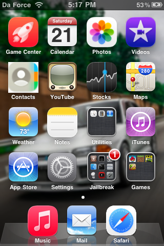

<table><tr><td></td><td valign="middle"><h1><b>iliketurbos' Cydia Repository</b></h1></td></tr></table>

## Packages
### Icon Themes
<table><tr><td></td><td valign="middle"><a href="http://iliketurboscydiarepo.bob.com.ar/depictions/?p=com.liquidglasslegacy.iliketurbos">Liquid Glass Legacy</a> - V1.1 </td></tr></table>

An icon reskin with all icons sourced from https://logos.fandom.com/wiki/Category:Apple or custom-made

<table><tr>
<td valign="top">
  
Icons Included:

• App Store

• Calculator

• Camera

• Clock

• Compass

• Contacts

• Cydia

• Game Center

• iTunes

• Mail

• Maps

• Messages

• Music

• Notes

• Phone

• Photos

• Safari

• Settings

• Stocks

• Videos

• Voice Memos

• Weather

• YouTube (The one that comes with iOS 5 and lower.)

</td>
<td></td>
</tr></table>

### Tweaks
<table><tr><td></td><td valign="middle"><a href="https://iliketurboscydiarepo.bob.com.ar/depictions/?p=cydiahttpatch-1.0">HTTPatch</a> - V1.0</td></tr></table>
This allows any version of iOS to add this tweak. It's designed for iOS 3, so it may not work on other versions. Original link is here: https://cydia.invoxiplaygames.uk/package/cydiahttpatch

Original Description:Cydia HTTPatch is a tweak that makes Cydia request its pages over HTTP, improving the usability and speed drastically on iOS 3. It * **should not** * be installed on iOS 4 and above as they support Server Name Identification (SNI) over HTTPS, removing the need for this tweak - the tweak also gives every loaded webpage access to the cydia JavaScript object, posing a potential security risk. Use with caution.
